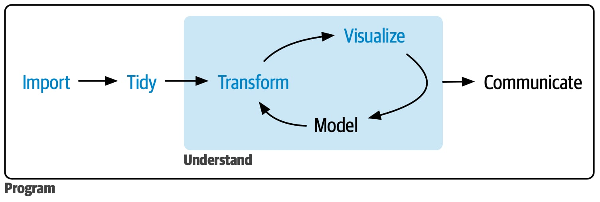

# Introduction 🌟

Welcome to the world of **Tidyverse**! Think of it as a toolkit for data wizards 🧙‍♂️—it's a collection of R packages designed to make data science simpler, faster, and way more fun! Here’s your guide to unleashing its magic. ✨



## Why Tidyverse? 🤔

-   Unified tools for data manipulation, visualization, and more.
-   Consistent syntax across all packages (less learning, more doing).
-   Focus on **tidy data**: each variable is a column, and each observation is a row.

## Core Features of the Tidyverse 🛠️

### **Unified Framework**

📦 All packages work together seamlessly:

-   **Consistent grammar**: Write code that feels natural across tools.
-   **Tidy data** philosophy: A clean, predictable structure to work with.

### **Key Packages to Know**

#### **`ggplot2`: Data Visualization** 🎨

-   Build stunning visuals layer by layer using the Grammar of Graphics framework.

**Example 1:** Basic scatter plot:

```{r}
library(ggplot2)
ggplot(
  mtcars,
  aes(x = hp, y = mpg, color = factor(cyl))
) +
  geom_point() +
  labs(title = "Horsepower vs. MPG", x = "Horsepower", y = "Miles per Gallon")
```

**Example 2:** Adding a smoothing line:

```{r}
ggplot(mtcars, aes(x = hp, y = mpg)) +
  geom_point() +
  geom_smooth(method = "lm", color = "blue") +
  labs(title = "MPG vs Horsepower with Trendline")
```

**Example 3:** Customizing themes:

```{r}
ggplot(mtcars, aes(x = wt, y = mpg)) +
  geom_point() +
  theme_minimal() +
  labs(title = "Weight vs MPG", x = "Weight (1000 lbs)", y = "Miles per Gallon")
```

📌 **Pro Tips for `ggplot2`**:

-   Use `aes()` to map variables to aesthetics like color, size, or shape.
-   Explore themes like `theme_minimal()` or `theme_classic()` to change the look of your plots.

#### **`dplyr`: Data Manipulation** 🛠️

-   Filter, arrange, mutate, and summarize your data with ease.

**Example 1:** Filtering rows:

```{r}
mtcars %>%
  filter(mpg > 20, cyl == 4)
```

**Example 2:** Creating new columns:

```{r}
mtcars %>%
  mutate(efficiency = mpg / wt)
```

**Example 3:** Grouping and summarizing:

```{r}
mtcars %>%
  group_by(cyl) %>%
  summarize(avg_mpg = mean(mpg))
```

📌 **Pro Tips for `dplyr`**:

-   Use `%>%` (the pipe operator) to chain operations for readable code.
-   Combine multiple `dplyr` functions for powerful workflows.

#### **`tidyr`: Data Tidying** 🧹

-   Reshape messy datasets into tidy data for analysis.

**Example 1:** Pivoting longer:

```{r}
data <- data.frame(
  Name = c("Alice", "Bob"),
  Score1 = c(90, 80),
  Score2 = c(85, 88)
)

data %>%
  pivot_longer(cols = starts_with("Score"), names_to = "Test", values_to = "Score")
```

**Example 2:** Pivoting wider:

```{r}
data <- data.frame(
  Name = c("Alice", "Bob"),
  Test = c("Math", "Science"),
  Score = c(95, 88)
)

data %>%
  pivot_wider(names_from = Test, values_from = Score)
```

**Example 3:** Separating a column:

```{r}
data <- data.frame(
  ID = c("A-1", "B-2"),
  Score = c(85, 90)
)

data %>%
  separate(ID, into = c("Letter", "Number"), sep = "-")
```

📌 **Pro Tips for `tidyr`**:

-   Use `pivot_longer()` and `pivot_wider()` to reshape your data.
-   Use `separate()` and `unite()` to split or combine columns as needed.

## How to Install and Load the Tidyverse 🖥️

```{r}
install.packages("tidyverse")  # Install the Tidyverse
library(tidyverse)             # Load all core packages
```

## Pro Tips 🌟

-   Use the `cheatsheets`: They’re like game walkthroughs for R. Download them [here](https://www.rstudio.com/resources/cheatsheets/).
-   Experiment with small datasets before jumping into big projects.

## Wrapping Up 🎁

The Tidyverse makes R programming friendlier and more efficient. Think of it as your ultimate toolkit for data science adventures! 🌈 Dive in, explore, and let your data shine. 🚀

------------------------------------------------------------------------

Good luck, data wizard! 🧙‍♀️
